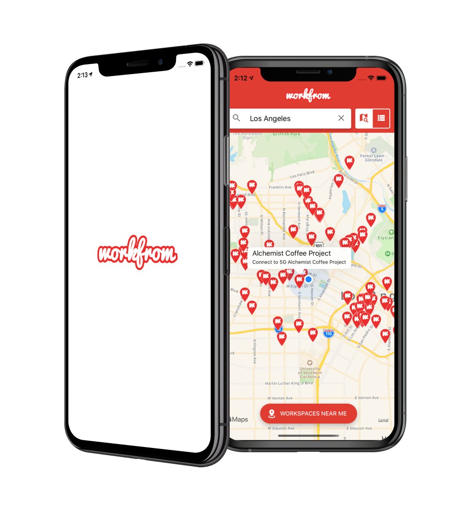

I absolutely love [Workfrom](https://workfrom.co/) and use it in every city that I visit. However, their native apps haven't been updated in over 3 years and are kind of a pain to use.

So, I created my own. It uses the hidden Workfrom API and directs users to the web app for more details.

    <a href="https://github.com/jaydenwindle/workfrom-clone" target="_blank" rel="noreferrer" style="color: #fff; text-decoration: none" class="bg-gray-900 hover:bg-gray-800 hover:shadow-lg text-white font-bold py-2 px-4 rounded flex flex-row">
        View on Github
    </a>
    <a href="https://expo.io/@jaydenwindle/workfrom-clone" target="_blank" rel="noreferrer" style="background-color: #4630EB; color: #fff; text-decoration: none" class="hover:bg-gray-800 hover:shadow-lg text-white font-bold py-2 px-4 rounded flex flex-row ml-4">
        Download with Expo
    </a>

